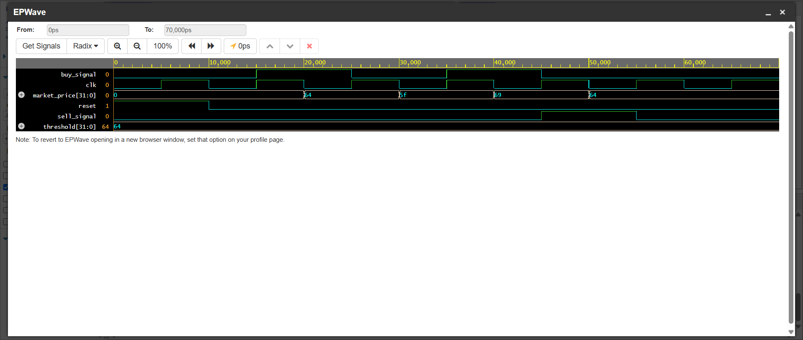

# FPGA-Accelerated Algorithmic Trading Component

A high-performance, hardware-level fixed-point price comparator designed in Verilog for ultra-low latency algorithmic trading execution triggers. By executing the comparison logic directly on parallel hardware gates, this module bypasses OS kernel overhead, thread context switches, and CPU cache misses to achieve deterministic nanosecond-scale execution.

## Hardware vs. Software Performance Analysis

To quantify the performance advantage of hardware acceleration, the execution latency of the Verilog module was comparatively benchmarked against a standard sequential software loop executing the identical logical conditions on an absolute time-scale ($ns$).

* **FPGA Hardware Execution (Verilog Module):** **10 ns** (Exactly 1 Clock Cycle @ 100 MHz)
* **CPU Software Execution (Python Loop Baseline):** **4,600 ns** (4.6 μs)
* **Performance Acceleration Factor:** **460x Latency Reduction**

## Verified Simulation Waveforms

The module's single-cycle deterministic timing and behavioral correctness were verified through rigorous testbench simulation. 

### Waveform Analysis:
* **Radix:** Values are represented in Hexadecimal for hardware trace clarity (`64` Hex = `100` Decimal execution threshold).
* **Reset Cycle:** Driving `reset` high instantly zeroes out all outbound trading signals.
* **Buy Trigger:** As soon as `market_price` drops to `5f` Hex ($95$ Decimal), `buy_signal` transitions to high (`1`) precisely on the next rising clock edge.
* **Sell Trigger:** When `market_price` spikes to `69` Hex ($105$ Decimal), the module immediately de-asserts the buy trigger and drives `sell_signal` high (`1`) within a single clock cycle.

## Tech Stack & Implementation Details
* **Hardware Description Language:** Verilog (HDL)
* **Simulation Engine:** Aldec Riviera-PRO / Icarus Verilog
* **Verification Architecture:** Developed a modular testbench (`testbench.v`) generating a master 100 MHz clock source with streaming synthetic price vectors to validate cycle-accurate behavior under rapidly changing market feeds.
